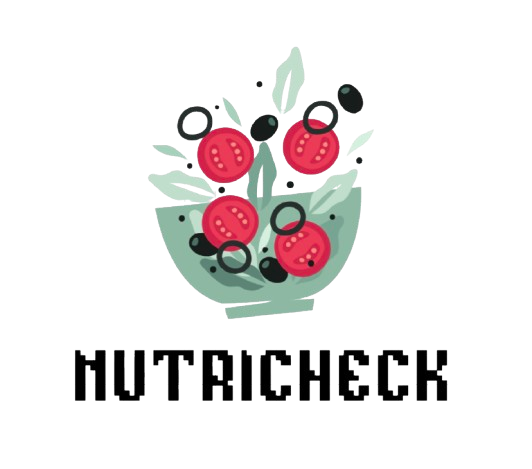
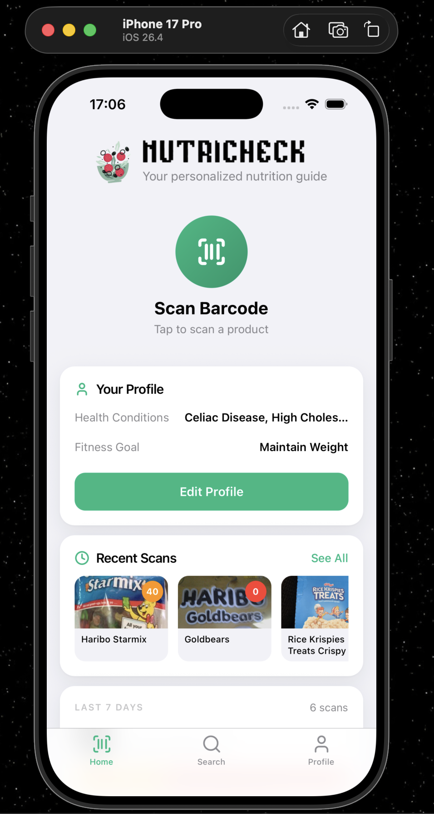
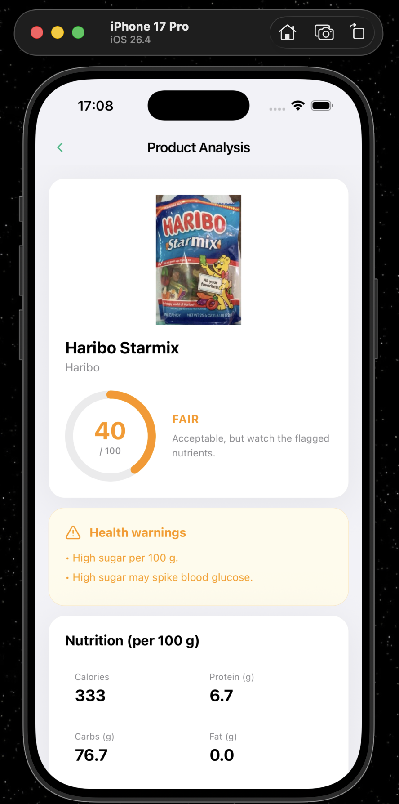
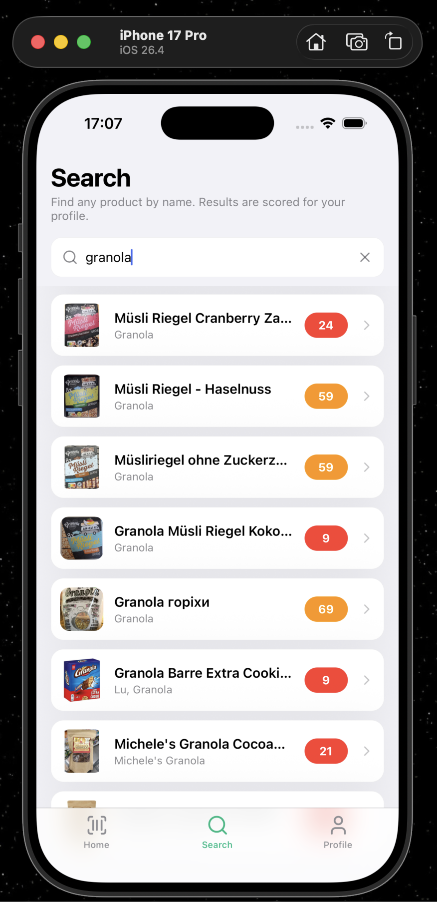
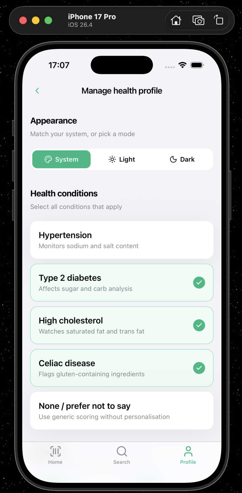
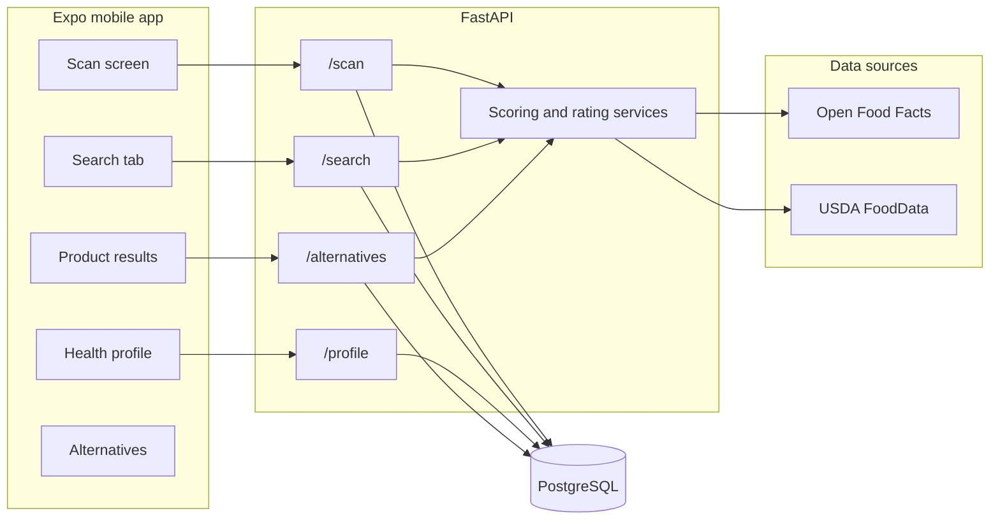

<div align="center">

<picture>
  <source media="(prefers-color-scheme: dark)" srcset="frontend/assets/logo/nutricheck-dark.png">
  <source media="(prefers-color-scheme: light)" srcset="frontend/assets/logo/nutricheck-light.png">
  
</picture>

### Scan. Understand. Eat better.

A mobile app that turns a barcode into a clear, personalized read on what you're about to eat
nutrition score, flagged ingredients for your health profile, and better alternatives on the shelf.

<p>
  
  
  
  
  
  
</p>

<br>

<table>
  <tr>
    <td align="center" width="33%">
      <br>
      <sub><b>Home</b><br>Profile-aware dashboard with recent scans</sub>
    </td>
    <td align="center" width="33%">
      <br>
      <sub><b>Product analysis</b><br>Score ring, health warnings, nutrition</sub>
    </td>
    <td align="center" width="33%">
      <br>
      <sub><b>Search</b><br>Find a product by name — scored for <i>you</i></sub>
    </td>
  </tr>
</table>

</div>

---

## What it does

- **Scan a barcode** with the camera (or type it in) and get back a product card: nutrition grade,
  macro breakdown, and ingredient-level flags for anything that clashes with your health profile.
- **Search by product name** when a barcode is missing or damaged.
- **Tap into any ingredient** for a short, plain-English explainer and a safety read based on your
  profile — not medical advice, just context.
- **See alternatives** on the same shelf that score better for *you* specifically.
- **Keep a scan history** so you can revisit anything you've already looked up.
- **Health profile** captures conditions (diabetes, hypertension, allergies, dietary restrictions)
  and drives every flag and recommendation.

Data is sourced from [Open Food Facts](https://world.openfoodfacts.org/) with an optional
[USDA FoodData Central](https://fdc.nal.usda.gov/) key for enrichment.

### Personal, not generic

The same product gets a different score for different people. Flip on "Type 2 diabetes" and sugar
warnings carry more weight; flip on "Celiac" and gluten ingredients light up; the home card updates
its copy accordingly. Works in light and dark mode out of the box.

<div align="center">
  <table>
    <tr>
      <td align="center" width="100%">
        <br>
        <sub>Manage health profile — Light</sub>
      </td>
    </tr>
  </table>
</div>

## Tech stack

| Layer      | Stack                                                                              |
| ---------- | ---------------------------------------------------------------------------------- |
| Mobile     | Expo 55, React Native 0.83, expo-router, react-query, reanimated, expo-camera, TS  |
| API        | FastAPI, Pydantic v2, SQLAlchemy 2, Alembic, httpx                                 |
| Database   | PostgreSQL 16 (via docker-compose)                                                 |
| Data       | Open Food Facts, USDA FoodData Central                                             |
| Dev        | Docker / docker-compose, `pyenv`/`venv`, Node 20+, Xcode or Android SDK for native |

## Architecture



## Getting started

### Prereqs

- Node **20+** and npm
- Python **3.11+**
- Docker Desktop (for the Postgres + API bundle) or a local Postgres
- Xcode / Android Studio if you want to run on a simulator or physical device

### 1. Clone

```bash
git clone https://github.com/brianmmaina/NutriCheck.git
cd NutriCheck
```

### 2. Backend + database (the easy path)

```bash
cp backend/.env.example backend/.env   # tweak if you like
docker compose up --build
```

That brings up:

- `postgres` on host port **5433** (container port 5432)
- `api` on [http://localhost:8000](http://localhost:8000) with `GET /health` returning `{"status":"ok"}`

### 2b. Backend without Docker

```bash
python -m venv .venv && source .venv/bin/activate
pip install -r backend/requirements.txt
cp backend/.env.example backend/.env
alembic -c backend/alembic.ini upgrade head
uvicorn backend.main:app --reload --host 0.0.0.0 --port 8000
```

### 3. Mobile app

```bash
cd frontend
npm install
cp .env.example .env    # point EXPO_PUBLIC_API_BASE_URL at your API
npm start               # Expo dev server
# or: npm run ios / npm run android / npm run web
```

To run on a physical iPhone on the same Wi-Fi, set `EXPO_PUBLIC_API_BASE_URL`
to `http://<your-mac-LAN-IP>:8000` and use `npm run start:device`.

## Project layout

```
NutriCheck/
├── backend/                 FastAPI service
│   ├── main.py              app + router wiring
│   ├── routers/             scan, search, alternatives, profile, users, ...
│   ├── services/            scoring, ratings, OpenFoodFacts client, ...
│   ├── models/ schemas/     SQLAlchemy models + Pydantic DTOs
│   └── alembic/             migrations
├── frontend/                Expo / React Native app
│   ├── app/                 expo-router screens: (tabs), product, ingredient, alternatives, scan, search
│   ├── app/lib/             query client + typed API hooks (useScan, useSearch, useProfile, ...)
│   ├── components/          Logo, ScoreRing, ScoreBadge, RecentScansSkeleton, ...
│   ├── context/             ThemeContext, AuthContext
│   └── assets/logo/         brand marks used above
├── design-reference/        source-of-truth UI reference (shadcn-style components + mocks)
├── docker-compose.yml
└── scripts/                 local tooling
```

## API at a glance

| Method   | Path                        | What it does                                          |
| -------- | --------------------------- | ----------------------------------------------------- |
| GET      | `/health`                   | liveness                                              |
| GET/PUT  | `/profile/{user_id}`        | fetch or update a user's health profile               |
| POST     | `/scan`                     | score a barcode against the user's profile            |
| GET      | `/scan-history/{user_id}`   | recent scans                                          |
| GET      | `/search`                   | product search by name                                |
| GET      | `/alternatives/{productId}` | better-fit products for the current profile           |

Legacy `/api/*` endpoints from the pre-refactor shape are kept alongside for the mobile migration
window. See [`backend/main.py`](backend/main.py).

## Scripts

| Command                                      | Purpose                             |
| -------------------------------------------- | ----------------------------------- |
| `docker compose up --build`                  | Postgres + API                      |
| `alembic -c backend/alembic.ini upgrade head`| Apply migrations                    |
| `npm start` (in `frontend/`)                 | Expo dev server                     |
| `npm run start:device`                       | Expo dev server bound to your LAN IP|
| `uvicorn backend.main:app --reload`          | API with autoreload                 |

## Disclaimer

NutriCheck surfaces public nutrition and ingredient data and flags items based on a user-supplied
health profile. It is **informational only and is not medical advice**. Please consult a qualified
clinician for medical, dietary, or allergy decisions.

## Credits

- [Open Food Facts](https://world.openfoodfacts.org/) — product and ingredient data
- [USDA FoodData Central](https://fdc.nal.usda.gov/) — nutrient enrichment
- Icon set by [Lucide](https://lucide.dev)

---

<div align="center">

<picture>
  <source media="(prefers-color-scheme: dark)" srcset="frontend/assets/logo/icon-dark.png">
  <source media="(prefers-color-scheme: light)" srcset="frontend/assets/logo/icon-light.png">
  
</picture>


</div>
